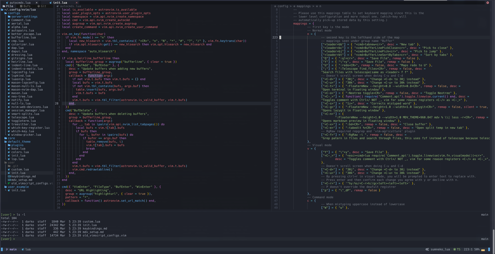

### IMPORTANT NOTE:

NOT compatible with:

- AstroVim 3.x+
- NerdFont 3.x+
- Nvim 9.x+

If you install the latest version, you will have to downgrade it or rewrite the configs for AstroVim 3.x and patch NerdFont because the icons are broken on 3.x

### Downgrading steps (brew):

1. Neovim to 0.8.1

```bash
brew unlink neovim
brew install ./brew-custom/nvim-0.8.1/neovim.rb
```

2. NerdFont to 2.3.3

```bash
brew install --cask ./brew-custom/local-nerd-font/font-hack-nerd-font.rb
```

If using ITerm2 you need to go to Settings -> Profiles -> Text -> Font -> Hack Nerd Font (if it's already selected, change to another font and change back to apply the changes)

\*formulas are downloaded from:

- https://github.com/Homebrew/homebrew-core
- https://github.com/Homebrew/homebrew-cask-fonts

## Custom and extended config of AstroVim


